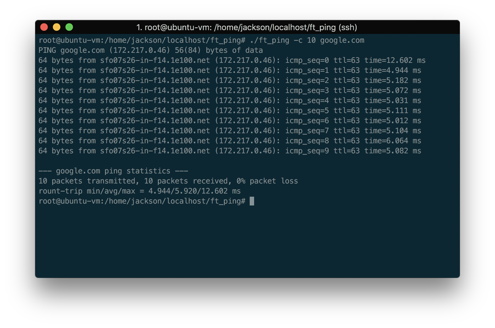

# ft_ping
This is a simple ping program built as an exercise in socket programming with IP/ICMP and raw posix sockets. It will properly perform DNS and reverse lookup and issue standard ICMP Echo Request packets to specified addresses.
Return packages are filtered for ICMP Echo Response packets tagged with the proper pid. A verbose mode that captures all incoming ICMP packets and a flood mode that pushes packets to a target as fast as possible without listening for a response are provided. A few additional options also exist for specifying send count and ttl.
The executable requires root permissions or CAP_NET_RAW capabilities.

## Build
`https://github.com/jacksonwb/ft_ping.git && cd ft_ping && make`

## Usage
`./ft_ping [-hvf] -[c count] -[t ttl] host`

## Options
`-h` - show usage

`-b` - verbose mode - all icmp packets will be printed along with their type

`-f` - flood mode - packets will be sent to the target as fast as possible without waiting for a response

`-c` - specify number of packets to send

`-t` - specify the packet ttl
